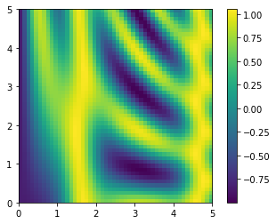
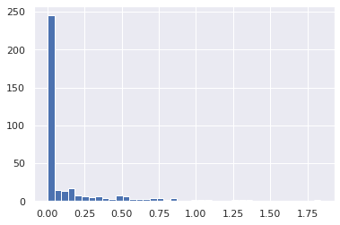

I use this notebook to build my muscle memory.
These are examples from **_Python Data Science Handbook_** by Jake VanderPlas.

```python
import numpy as np
np.random.seed(0) # seed for reproducibility
x1 = np.random.randint(10, size=6)
x2 = np.random.randint(10, size=(3,4))
x3 = np.random.randint(10, size=(3,4,5))
print('array x1:', x1)
print('array x2:', x2)
print('array x3:', x3)
print('x3 type:', x3.dtype)
```

    array x1: [5 0 3 3 7 9]
    array x2: [[3 5 2 4]
     [7 6 8 8]
     [1 6 7 7]]
    array x3: [[[8 1 5 9 8]
      [9 4 3 0 3]
      [5 0 2 3 8]
      [1 3 3 3 7]]
    
     [[0 1 9 9 0]
      [4 7 3 2 7]
      [2 0 0 4 5]
      [5 6 8 4 1]]
    
     [[4 9 8 1 1]
      [7 9 9 3 6]
      [7 2 0 3 5]
      [9 4 4 6 4]]]
    x3 type: int64


```python
x2_copy = x2[1:2, 1:3].copy()
```


```python
print(x2_copy)
```

    [[6 8]]


```python
A1 = np.array([1, 2, 3])
```


```python
A2 = np.array([4, 5, 6])
A3 = np.array([12, 25, 57])
A4 = np.concatenate([A1, A2, A3])
print(A4)
```

    [ 1  2  3  4  5  6 12 25 57]


```python
A5 = A4.reshape(3, 3)
```


```python
print(A5)
```

    [[ 1  2  3]
     [ 4  5  6]
     [12 25 57]]


```python
#Broadcasting--plotting a two-dimensional function
import numpy as np
x = np.linspace(0, 5, 50)
y = np.linspace(0, 5, 50)[:, np.newaxis]
z = np.sin(x) ** 10 + np.cos(10 + y * x) * np.cos(x)
print(x, y, z)
%matplotlib inline
import matplotlib.pyplot as plt
plt.imshow(z, origin='lower', extent=[0, 5, 0, 5], cmap='viridis')
plt.colorbar();
```

    [0.         0.10204082 0.20408163 0.30612245 0.40816327 0.51020408
     0.6122449  0.71428571 0.81632653 0.91836735 1.02040816 1.12244898
     1.2244898  1.32653061 1.42857143 1.53061224 1.63265306 1.73469388
     1.83673469 1.93877551 2.04081633 2.14285714 2.24489796 2.34693878
     2.44897959 2.55102041 2.65306122 2.75510204 2.85714286 2.95918367
     3.06122449 3.16326531 3.26530612 3.36734694 3.46938776 3.57142857
     3.67346939 3.7755102  3.87755102 3.97959184 4.08163265 4.18367347
     4.28571429 4.3877551  4.48979592 4.59183673 4.69387755 4.79591837
     4.89795918 5.        ] [[0.        ]
     [0.10204082]
     [0.20408163]
     [0.30612245]
     [0.40816327]
     [0.51020408]
     [0.6122449 ]
     [0.71428571]
     [0.81632653]
     [0.91836735]
     [1.02040816]
     [1.12244898]
     [1.2244898 ]
     [1.32653061]
     [1.42857143]
     [1.53061224]
     [1.63265306]
     [1.73469388]
     [1.83673469]
     [1.93877551]
     [2.04081633]
     [2.14285714]
     [2.24489796]
     [2.34693878]
     [2.44897959]
     [2.55102041]
     [2.65306122]
     [2.75510204]
     [2.85714286]
     [2.95918367]
     [3.06122449]
     [3.16326531]
     [3.26530612]
     [3.36734694]
     [3.46938776]
     [3.57142857]
     [3.67346939]
     [3.7755102 ]
     [3.87755102]
     [3.97959184]
     [4.08163265]
     [4.18367347]
     [4.28571429]
     [4.3877551 ]
     [4.48979592]
     [4.59183673]
     [4.69387755]
     [4.79591837]
     [4.89795918]
     [5.        ]] [[-0.83907153 -0.83470697 -0.8216586  ...  0.8956708   0.68617261
       0.41940746]
     [-0.83907153 -0.82902677 -0.8103873  ...  0.92522407  0.75321348
       0.52508175]
     [-0.83907153 -0.82325668 -0.79876457 ...  0.96427357  0.84172689
       0.66446403]
     ...
     [-0.83907153 -0.48233077 -0.01646558 ...  0.96449925  0.75196531
       0.41982581]
     [-0.83907153 -0.47324558  0.00392612 ...  0.92542163  0.68540362
       0.37440839]
     [-0.83907153 -0.46410908  0.02431613 ...  0.89579384  0.65690314
       0.40107702]]


    

    


### Counting rainy days


```python
import numpy as np
import pandas as pd

rainfall = pd.read_csv('./Seattle2014.csv')['PRCP'].values
inches = rainfall / 254 

print(inches.shape)

print(np.sum(inches > 0.5))

print('Number days without rain:      ', np.sum(inches == 0))
print('Number days with rain:         ', np.sum(inches != 0))
print('Days with more than 0.5 inches:', np.sum(inches > 0.5))
print('Rainy days with < 0.1 inches:  ', np.sum((inches > 0) & (inches < 0.1)))

%matplotlib inline
import matplotlib.pyplot as plt
import seaborn; seaborn.set()
plt.hist(inches, 40);
```

    (365,)
    37
    Number days without rain:       215
    Number days with rain:          150
    Days with more than 0.5 inches: 37
    Rainy days with < 0.1 inches:   46


    

    

